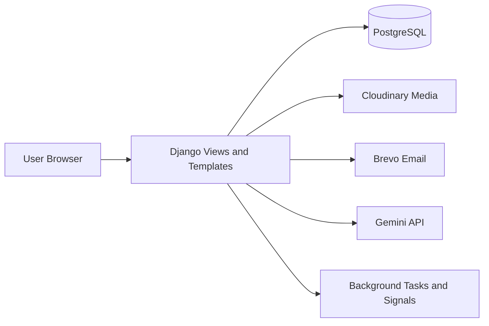

# BrightTrack LMS

A role-based Learning Management System (LMS) with built-in student support monitoring.

BrightTrack helps schools manage classes, assignments, attendance, messaging, wellness check-ins, risk alerts, interventions, and reports in one platform.

Live site: https://bright-track-project.onrender.com

## Table of Contents
- [Core Modules](#core-modules)
- [User Roles](#user-roles)
- [Key Features](#key-features)
- [Security Highlights](#security-highlights)
- [System Architecture](#system-architecture)
- [Project Structure](#project-structure)
- [Technology Stack](#technology-stack)
- [Local Setup](#local-setup)
- [Environment Variables](#environment-variables)
- [Deployment (Render)](#deployment-render)
- [Main Routes](#main-routes)
- [Data Models (Summary)](#data-models-summary)
- [Testing and Validation](#testing-and-validation)
- [Roadmap](#roadmap)

## Core Modules
- `accounts`: authentication, OTP, profile, role access, audit logs
- `academics`: classes, attendance, assignments, submissions, materials, grades
- `wellness`: check-ins, risk assessments, alerts, interventions, reports
- `messaging`: conversations, attachments, read states, report flow
- `ai_assistant`: assistant endpoints for admin/counselor workflows
- `ml_models`: prediction and AI-related service logic

## User Roles
- Student
- Teacher
- Counselor
- Admin

Each role gets a dedicated dashboard and scoped permissions.

## Key Features
- OTP-based verification for sensitive auth flows
- Class and assignment management for teachers
- Attendance tracking and grade tracking
- Student submission and feedback flow
- Wellness check-in with risk analysis
- Alerts and intervention management
- In-app messaging with attachment support
- Audit logging for sensitive actions
- Profile management with image upload
- Activity timeline on profile (last login, recent actions, session/device info)

## Security Highlights
- Role-based access checks across major views
- OTP expiration and failed-attempt limits
- Rate limiting on sensitive endpoints
- CSRF protection and POST-only handling for destructive actions
- Audit entries with integrity hash chaining (`previous_hash`, `entry_hash`)
- Protected media serving with permission checks
- Secure cookie and HTTPS-focused production settings

## System Architecture


## Project Structure
```text
campus-care-project/
|- accounts/
|- academics/
|- wellness/
|- messaging/
|- ai_assistant/
|- ml_models/
|- campus_care/          # settings, urls, middleware
|- templates/
|- static/
|- manage.py
|- requirements.txt
|- build.sh
`- README.md
```

## Technology Stack
- Backend: Django 5, Python 3.12
- Database: PostgreSQL
- Frontend: Django Templates, Tailwind CSS, Vanilla JS, Chart.js
- Auth: Django auth + OTP + allauth integration
- File Storage: Cloudinary (production), local media (development)
- Email: Brevo transactional API
- AI: Gemini API integration
- Deployment: Render
- Static handling: WhiteNoise

## Local Setup
```bash
# 1) Clone
git clone https://github.com/haruto-web/campus-care-project.git
cd campus-care-project

# 2) Create virtual environment
python -m venv .venv

# Windows (PowerShell)
.\.venv\Scripts\Activate.ps1

# 3) Install dependencies
pip install -r requirements.txt

# 4) Configure env
copy .env.example .env

# 5) Run migrations
python manage.py migrate

# 6) Create superuser (optional)
python manage.py createsuperuser

# 7) Start server
python manage.py runserver
```

## Environment Variables
Typical production variables:

```env
SECRET_KEY=
DEBUG=False
DATABASE_URL=
ALLOWED_HOSTS=bright-track-project.onrender.com,localhost,127.0.0.1
RENDER_EXTERNAL_HOSTNAME=bright-track-project.onrender.com

CLOUDINARY_CLOUD_NAME=
CLOUDINARY_API_KEY=
CLOUDINARY_API_SECRET=

BREVO_API_KEY=
EMAIL_HOST_USER=

GEMINI_API_KEY=
GOOGLE_CLIENT_ID=
GOOGLE_CLIENT_SECRET=
```

## Deployment (Render)
`build.sh`:
```bash
pip install -r requirements.txt
python manage.py collectstatic --noinput
python manage.py migrate
python manage.py migrate sites || true
python manage.py configure_site || true
python manage.py create_superuser || true
```

## Main Routes
- `/` - landing / authentication entry
- `/login/`, `/register/`, `/verify-otp/`, `/forgot-password/`
- `/dashboard/` - role-based dashboard redirect
- `/class/` - academics module
- `/wellness/` - wellness and interventions
- `/messages/` - messaging module
- `/ai/` - AI assistant features
- `/admin/` - Django admin

## Data Models (Summary)
- `accounts.User`: role, profile data, session key, identity fields
- `accounts.OTPCode`: OTP lifecycle and expiry
- `accounts.AuditLog`: actor, action, target, metadata, integrity hashes
- `academics.Class`, `Assignment`, `Submission`, `Attendance`, `Material`, `Announcement`, `Grade`
- `wellness.WellnessCheckIn`, `RiskAssessment`, `Alert`, `Intervention`, `TeacherConcern`
- `messaging.Conversation`, `Message`

## Testing and Validation
Quick checks:
```bash
python manage.py check
python manage.py test
python -m py_compile accounts\views.py
```

Manual security validation examples:
- Repeated OTP failures should trigger lockout behavior
- Unauthorized role routes should return permission denial
- Audit logs should display integrity status
- Protected media links should not be accessible without permission

## Roadmap
- Expand automated test coverage for auth and authorization flows
- Add richer observability dashboards for security events
- Improve report export options and forensic filtering
- Enhance onboarding and guided UX for each role

## License
Internal academic/capstone project (update this section if you want an open-source license).
