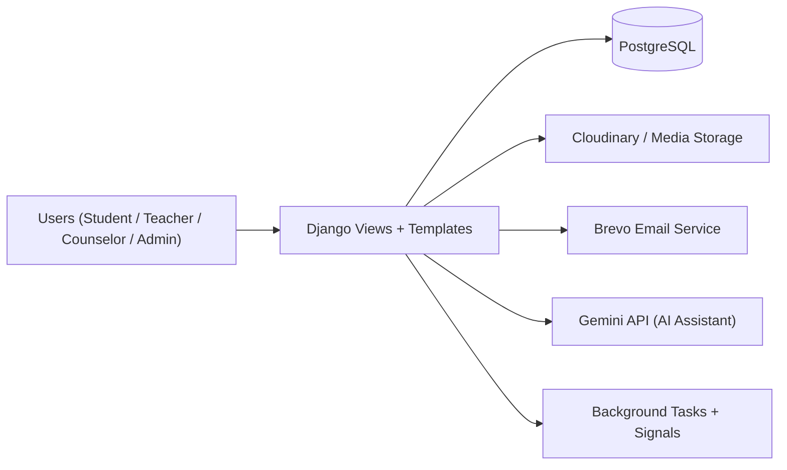

# BrightTrack LMS

> Enterprise-style School LMS + Student Support Intelligence Platform

[](#)
[](#technology-stack)
[](#technology-stack)
[](#deployment-render)
[](#security--compliance)

BrightTrack is a role-based Learning Management System (LMS) designed for schools that need both academic operations and proactive student support in one platform.

It combines classes, attendance, grades, submissions, messaging, wellness monitoring, at-risk detection, intervention workflows, and audit visibility.

## Live System

- Production URL: [https://bright-track-project.onrender.com](https://bright-track-project.onrender.com)

## Table of Contents

- [Product Vision](#product-vision)
- [Core Modules](#core-modules)
- [Role-Based Experience](#role-based-experience)
- [Feature Highlights](#feature-highlights)
- [Security \& Compliance](#security--compliance)
- [System Architecture](#system-architecture)
- [Main Workflows](#main-workflows)
- [Project Structure](#project-structure)
- [Technology Stack](#technology-stack)
- [Setup (Local Development)](#setup-local-development)
- [Environment Variables](#environment-variables)
- [Deployment (Render)](#deployment-render)
- [Primary Routes](#primary-routes)
- [Data Model Snapshot](#data-model-snapshot)
- [Quality Checks](#quality-checks)
- [Roadmap](#roadmap)

## Product Vision

BrightTrack helps institutions move from reactive to proactive student support by combining:

- 📚 Academic management
- 🧠 Wellness and behavioral signals
- 🚨 Early warning alerts
- 🤝 Intervention tracking
- 🔒 Security-first authentication and auditing

## Core Modules

- `accounts` - authentication, OTP, registration flow, profile, audit logs, admin management
- `academics` - classes, assignments, submissions, attendance, grading, announcements, materials
- `wellness` - check-ins, risk analysis, alerts, interventions, teacher concerns, reports
- `messaging` - conversations, attachments, moderation/reporting flow, suspension controls
- `ai_assistant` - scoped AI assistant for admin/counselor operations
- `ml_models` - prediction logs and sentiment analysis records
- `campus_care` - settings, middleware, urls, global configuration

## Role-Based Experience

- 👨‍🎓 **Student**
  - Enrolled classes, submissions, grades, attendance, wellness check-ins, messages, notifications
- 👩‍🏫 **Teacher**
  - Class management, assignments, attendance tracking, student monitoring, concern submission
- 🧑‍⚕️ **Counselor**
  - At-risk student queue, interventions, alerts, report generation, message consequence handling
- 🛡️ **Admin**
  - User and class governance, registration approvals, audit review, system-level visibility

## Feature Highlights

- ✅ OTP-based verification for login, registration, and password reset flows
- ✅ Student registration approval workflow before account activation
- ✅ Multi-role dashboards with scoped permissions
- ✅ Assignment lifecycle (create, submit, grade, feedback)
- ✅ Wellness check-ins with risk signals and counselor interventions
- ✅ Real-time style notifications and role-based messaging
- ✅ Audit log tracking for sensitive actions with integrity verification
- ✅ Export-ready reports (CSV/PDF/DOCX depending on module/page)
- ✅ Profile and media handling with protected access checks

## Security & Compliance

BrightTrack includes layered controls aligned with STRIDE-focused hardening:

- 🔐 Role-based access control (RBAC)
- 🔐 OTP expiration and attempt thresholds
- 🔐 Rate limiting on sensitive endpoints and high-cost actions
- 🔐 CSRF + POST enforcement on destructive actions
- 🔐 Audit entries with hash-chain integrity (`previous_hash`, `entry_hash`)
- 🔐 Protected media/file serving with permission checks
- 🔐 Security notification emails (login/reset/password events)
- 🔐 Security headers and production-safe middleware behavior

## System Architecture



## Main Workflows

### 1) Student Registration & Approval

1. Student submits registration form.
2. OTP is sent and verified.
3. Registration request is stored as pending.
4. Admin approves or rejects request.
5. Approved students can log in and complete profile.

### 2) Academic Operations

1. Teacher manages class, assignments, attendance, and materials.
2. Students submit work and receive grades/feedback.
3. Academic data contributes to risk indicators.

### 3) Wellness & Intervention

1. Students submit wellness check-ins.
2. Risk/alert signals are generated.
3. Counselor reviews students and creates interventions.
4. Progress and outcomes are tracked for follow-up.

### 4) Messaging & Governance

1. Users communicate through role-aware messaging.
2. Inappropriate content can be reported.
3. Counselor/admin applies consequence workflow when needed.

## Project Structure

```text
campus-care-project/
|- accounts/
|- academics/
|- wellness/
|- messaging/
|- ai_assistant/
|- ml_models/
|- campus_care/
|- templates/
|- static/
|- manage.py
|- requirements.txt
|- build.sh
`- README.md
```

## Technology Stack

| Layer | Technology |
|---|---|
| Backend | Django 5, Python 3.x |
| Database | PostgreSQL |
| Frontend | Django Templates, Tailwind CSS, Vanilla JS, Chart.js |
| Authentication | Django Auth + OTP flow |
| File Storage | Cloudinary (prod), local media (dev) |
| Email | Brevo transactional API |
| AI | Gemini API integration |
| Deployment | Render |
| Static Serving | WhiteNoise |

## Setup (Local Development)

```bash
# 1) Clone
git clone https://github.com/haruto-web/campus-care-project.git
cd campus-care-project

# 2) Create virtual environment
python -m venv .venv

# Windows (PowerShell)
.\.venv\Scripts\Activate.ps1

# 3) Install dependencies
pip install -r requirements.txt

# 4) Configure env
copy .env.example .env

# 5) Migrate
python manage.py migrate

# 6) Optional superuser
python manage.py createsuperuser

# 7) Run
python manage.py runserver
```

## Environment Variables

```env
SECRET_KEY=
DEBUG=False
DATABASE_URL=
ALLOWED_HOSTS=bright-track-project.onrender.com,localhost,127.0.0.1
RENDER_EXTERNAL_HOSTNAME=bright-track-project.onrender.com

CLOUDINARY_CLOUD_NAME=
CLOUDINARY_API_KEY=
CLOUDINARY_API_SECRET=

BREVO_API_KEY=
EMAIL_HOST_USER=

GEMINI_API_KEY=
GOOGLE_CLIENT_ID=
GOOGLE_CLIENT_SECRET=
```

## Deployment (Render)

`build.sh`:

```bash
pip install -r requirements.txt
python manage.py collectstatic --noinput
python manage.py migrate
python manage.py migrate sites || true
python manage.py configure_site || true
python manage.py create_superuser || true
```

## Primary Routes

- `/` - Landing + auth entry
- `/login/` `/register/` `/verify-otp/` `/forgot-password/`
- `/dashboard/` - role-based dashboard
- `/class/` - academics
- `/wellness/` - wellness, alerts, interventions, reports
- `/messages/` - messaging and reports
- `/ai/` - AI assistant endpoints
- `/admin/` - Django admin

## Data Model Snapshot

- `accounts.User`, `OTPCode`, `RegistrationRequest`, `ApprovedStudent`, `AuditLog`
- `academics.Class`, `Assignment`, `Submission`, `Attendance`, `Grade`, `Announcement`, `Material`
- `wellness.WellnessCheckIn`, `RiskAssessment`, `Alert`, `Intervention`, `TeacherConcern`, `Notification`
- `messaging.Conversation`, `Message`, `MessageReport`
- `ml_models.PredictionLog`, `SentimentAnalysis`

## Quality Checks

```bash
python manage.py check
python manage.py test
python -m py_compile accounts/views.py
```

## Roadmap

- 📈 Expand end-to-end automated test coverage for critical flows
- 🔎 Add deeper investigation filters in audit and monitoring screens
- 🧪 Add more role-specific UX polish and guidance for first-time users
- 📊 Improve advanced analytics and intervention outcome dashboards

---

## Maintainer Notes

This project is used in an academic/capstone context and continuously improved through practical deployment and real workflow validation.
