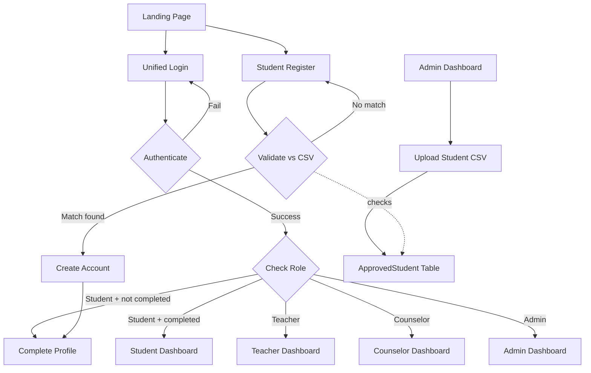
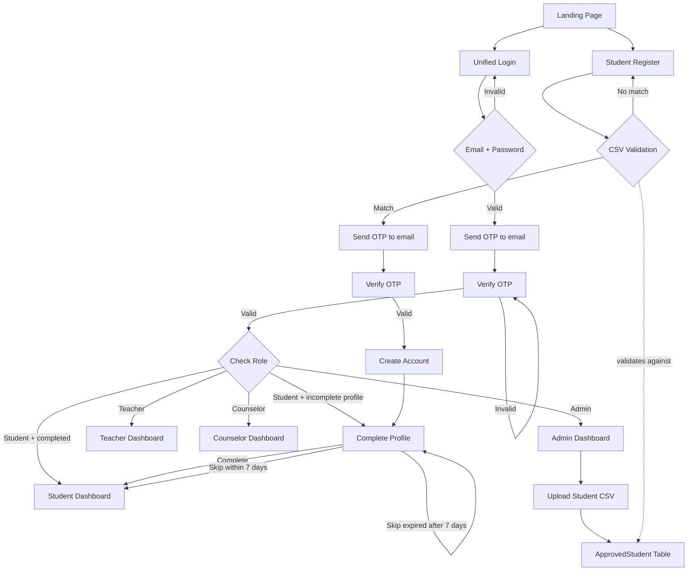

# System Changes: Unified Login & CSV Student Validation

## Problem Statement

The current system has **two separate login flows**:
- **Staff** (teacher/counselor/admin): Email + password at `/login/`
- **Students**: OTP-based flow at `/student/verify/` → OTP code → password

This creates confusion and the OTP flow has been causing 500 errors. Additionally, any student can register freely — there's no verification that they actually belong to the school.

## Goals

1. **Unified login** — Single login page for all roles (email + password)
2. **CSV-validated student registration** — Only pre-approved students (loaded from CSV) can register
3. **Role-based redirect** — After login, route to the correct dashboard
4. **Eliminate existing 500 errors** — The student dashboard crash is fixed as part of this work
5. **No new bugs or vulnerabilities** — Security-first approach

---

## Architecture Overview



---

## Proposed Changes

### 1. New Model: `ApprovedStudent`

#### [NEW] accounts/models.py — Add `ApprovedStudent` model

A database table of pre-approved students. Admin uploads CSV → populates this table. Registration validates against it.

```python
class ApprovedStudent(models.Model):
    student_number = models.CharField(max_length=20, unique=True)
    email = models.EmailField(unique=True)
    first_name = models.CharField(max_length=100)
    last_name = models.CharField(max_length=100)
    year_level = models.CharField(max_length=2, choices=User.YEAR_LEVEL_CHOICES)
    section = models.CharField(max_length=50, blank=True)
    is_registered = models.BooleanField(default=False)  # True once they've registered
    uploaded_at = models.DateTimeField(auto_now_add=True)

    class Meta:
        ordering = ['last_name', 'first_name']

    def __str__(self):
        return f"{self.student_number} — {self.last_name}, {self.first_name}"
```

**Why a database model instead of reading CSV at runtime:**
- Faster lookups (indexed queries vs file parsing)
- Admin can manage records (add/edit/delete individual entries)
- Audit trail (`uploaded_at`, `is_registered`)
- No file I/O on every registration attempt
- Works across multiple server instances (Render)

---

### 2. Unified Login

#### [MODIFY] [views.py](file:///c:/Users/Sam/Github_Clone/campus-care-project/accounts/views.py)

**Remove the student-specific block** from `login_view` (lines 375-377):

```diff
 if user is not None:
-    if user.role == 'student':
-        messages.error(request, 'Students must log in using email OTP.')
-        return redirect('otp_request')
     login(request, user, backend='django.contrib.auth.backends.ModelBackend')
     return redirect('dashboard')
```

This makes `login_view` work for ALL roles. The existing `dashboard_view` already handles role-based routing.

**Deprecate OTP views** — Keep `otp_forgot_password_view` and `otp_reset_password_view` for password recovery, but remove/deprecate `otp_request_view`, `otp_verify_view`, `otp_login_password_view`, and `otp_register_view` from active use.

#### [MODIFY] [urls.py](file:///c:/Users/Sam/Github_Clone/campus-care-project/accounts/urls.py)

```diff
 urlpatterns = [
     path('', views.landing_view, name='landing'),
     path('login/', views.login_view, name='login'),
     path('register/', views.register_view, name='register'),
-    path('student/verify/', views.otp_request_view, name='otp_request'),
-    path('student/verify/code/', views.otp_verify_view, name='otp_verify'),
-    path('student/login/', views.otp_login_password_view, name='otp_login_password'),
-    path('student/register/', views.otp_register_view, name='otp_register'),
     path('student/forgot-password/', views.otp_forgot_password_view, name='otp_forgot_password'),
     path('student/reset-password/', views.otp_reset_password_view, name='otp_reset_password'),
+    # Admin CSV upload
+    path('manage/upload-students/', admin_views.admin_upload_students, name='admin_upload_students'),
```

> [!WARNING]
> Removing OTP login URLs means existing links/bookmarks to `/student/verify/` will 404. The landing page and all templates will be updated to point to `/login/` and `/register/`.

---

### 3. CSV-Validated Registration

#### [MODIFY] [views.py](file:///c:/Users/Sam/Github_Clone/campus-care-project/accounts/views.py) — Rewrite `register_view`

New registration flow:
1. Student enters: **student_number**, **email**, **password**, **confirm password**
2. Backend validates: `student_number` + `email` must match an `ApprovedStudent` record where `is_registered=False`
3. If match → create `User`, set `is_registered=True` on the `ApprovedStudent` record, auto-fill `first_name`, `last_name`, `year_level`, `section` from the approved record
4. If no match → error message

```python
def register_view(request):
    if request.user.is_authenticated:
        return redirect('dashboard')

    if request.method == 'POST':
        student_number = request.POST.get('student_number', '').strip()
        email = request.POST.get('email', '').strip().lower()
        password = request.POST.get('password', '')
        password2 = request.POST.get('password2', '')

        # Validate passwords
        if password != password2:
            messages.error(request, 'Passwords do not match.')
            return render(request, 'accounts/register.html')

        if len(password) < 8:
            messages.error(request, 'Password must be at least 8 characters.')
            return render(request, 'accounts/register.html')

        # Django password validators
        from django.contrib.auth.password_validation import validate_password
        try:
            validate_password(password)
        except DjangoValidationError as e:
            for msg in e.messages:
                messages.error(request, msg)
            return render(request, 'accounts/register.html')

        # Check if already registered
        if User.objects.filter(email=email).exists():
            messages.error(request, 'An account with this email already exists. Please login instead.')
            return render(request, 'accounts/register.html')

        # Validate against ApprovedStudent records
        from .models import ApprovedStudent
        approved = ApprovedStudent.objects.filter(
            student_number=student_number,
            email__iexact=email,
            is_registered=False
        ).first()

        if not approved:
            messages.error(request, 'Your student number and email do not match our records, or you have already registered. Please contact your administrator.')
            return render(request, 'accounts/register.html')

        # Create user with data from ApprovedStudent
        import uuid
        base = f"{approved.first_name.lower()}{approved.last_name.lower()}"
        username = f"{base}{str(uuid.uuid4())[:4]}"

        user = User(
            username=username,
            email=email,
            first_name=approved.first_name,
            last_name=approved.last_name,
            role='student',
            student_number=student_number,
            year_level=approved.year_level,
            section=approved.section,
        )
        user.set_password(password)
        user.save()

        # Mark as registered
        approved.is_registered = True
        approved.save()

        login(request, user, backend='django.contrib.auth.backends.ModelBackend')
        messages.success(request, 'Account created! Please complete your profile.')
        return redirect('complete_profile')

    return render(request, 'accounts/register.html')
```

**Security benefits:**
- Students cannot self-register without being in the approved list
- Student number + email must both match (two-factor identity verification)
- Names, year level, section are auto-filled from admin data (prevents spoofing)
- Each record can only be used once (`is_registered=True` flag)

---

### 4. Admin CSV Upload

#### [MODIFY] [admin_views.py](file:///c:/Users/Sam/Github_Clone/campus-care-project/accounts/admin_views.py) — Add `admin_upload_students`

```python
@login_required
def admin_upload_students(request):
    if request.user.role != 'admin':
        messages.error(request, 'Permission denied.')
        return redirect('dashboard')

    if request.method == 'POST' and request.FILES.get('csv_file'):
        import csv, io
        csv_file = request.FILES['csv_file']

        # Validate file type
        if not csv_file.name.endswith('.csv'):
            messages.error(request, 'Please upload a .csv file.')
            return redirect('admin_upload_students')

        # Validate file size (max 5MB)
        if csv_file.size > 5 * 1024 * 1024:
            messages.error(request, 'File too large. Maximum 5MB.')
            return redirect('admin_upload_students')

        decoded = csv_file.read().decode('utf-8-sig')
        reader = csv.DictReader(io.StringIO(decoded))

        required_columns = {'student_number', 'email', 'first_name', 'last_name', 'year_level'}
        if not required_columns.issubset(set(reader.fieldnames or [])):
            messages.error(request, f'CSV must have columns: {", ".join(sorted(required_columns))}')
            return redirect('admin_upload_students')

        created, skipped, errors = 0, 0, 0
        for i, row in enumerate(reader, start=2):
            try:
                obj, was_created = ApprovedStudent.objects.update_or_create(
                    student_number=row['student_number'].strip(),
                    defaults={
                        'email': row['email'].strip().lower(),
                        'first_name': row['first_name'].strip(),
                        'last_name': row['last_name'].strip(),
                        'year_level': row['year_level'].strip(),
                        'section': row.get('section', '').strip(),
                    }
                )
                if was_created:
                    created += 1
                else:
                    skipped += 1
            except Exception:
                errors += 1

        messages.success(request, f'Upload complete: {created} added, {skipped} updated, {errors} errors.')
        return redirect('admin_upload_students')

    # GET — show upload form + existing records
    from .models import ApprovedStudent
    approved_students = ApprovedStudent.objects.all()
    return render(request, 'accounts/admin_upload_students.html', {
        'approved_students': approved_students,
    })
```

#### [NEW] CSV Format (sample: `approved_students.csv`)

| student_number | email | first_name | last_name | year_level | section |
|---|---|---|---|---|---|
| 2024-00001 | juan.delacruz@school.edu | Juan | Dela Cruz | 7 | A |
| 2024-00002 | maria.santos@school.edu | Maria | Santos | 8 | B |
| 2024-00003 | pedro.reyes@school.edu | Pedro | Reyes | 9 | A |

---

### 5. Template Changes

#### [MODIFY] [landing.html](file:///c:/Users/Sam/Github_Clone/campus-care-project/templates/landing.html)

Update all buttons:
- "Student Login / Register" → `/register/` (for new students) or `/login/` (for existing)
- "Staff Sign In" → `/login/`
- Simplify to two buttons: **"Login"** and **"Register"**

#### [NEW] accounts/register.html — Simplified registration form

New fields: **Student Number**, **Email**, **Password**, **Confirm Password**. Remove: username, first_name, last_name, phone, year_level, gender, Google OAuth (names auto-filled from CSV data).

#### [MODIFY] [login.html](file:///c:/Users/Sam/Github_Clone/campus-care-project/templates/accounts/login.html)

Remove the "Student? Login or register with email OTP" link. This is now a unified login for everyone.

#### [NEW] accounts/admin_upload_students.html — Admin CSV upload page

File upload form + table of existing approved students with their registration status.

#### [MODIFY] [base.html](file:///c:/Users/Sam/Github_Clone/campus-care-project/templates/base.html) — Admin sidebar

Add "Upload Students" link in the admin sidebar section.

---

### 6. Database Migration

```bash
python manage.py makemigrations accounts
python manage.py migrate
```

This creates the `accounts_approvedstudent` table. No existing data is affected.

---

## What Gets Removed

| Item | Reason |
|------|--------|
| `otp_request_view` | Replaced by unified `login_view` |
| `otp_verify_view` | No longer needed |
| `otp_login_password_view` | Replaced by unified `login_view` |
| `otp_register_view` | Replaced by CSV-validated `register_view` |
| `/student/verify/` URL | Removed |
| `/student/verify/code/` URL | Removed |
| `/student/login/` URL | Removed |
| `/student/register/` URL | Removed |
| OTP-related templates | `otp_request.html`, `otp_verify.html`, `otp_login_password.html`, `otp_register.html` |
| Google OAuth on registration | Removed from register (kept for login if desired) |

> [!IMPORTANT]
> The `OTPCode` model and `otp_utils.py` are **kept** — they're still used by the forgot-password flow (`otp_forgot_password_view` + `otp_reset_password_view`).

## What Stays

| Item | Reason |
|------|--------|
| `OTPCode` model | Used for password reset |
| `otp_forgot_password_view` | Password recovery for students |
| `otp_reset_password_view` | Password recovery for students |
| `otp_utils.py` / Brevo integration | Sends OTP emails for password reset |
| `complete_profile_view` | Untouched, students still complete their profile |
| `dashboard_view` | Already handles role-based routing |
| All dashboard views | Untouched |
| Google OAuth on login page | Kept |

---

## Security Checklist

| Concern | How it's handled |
|---------|-----------------|
| Unauthorized registration | Only pre-approved students can register (CSV validation) |
| Identity spoofing | Student number + email must both match; names auto-filled from admin data |
| Double registration | `is_registered=True` flag prevents re-use of approved records |
| CSV injection | File type + size validation; `csv.DictReader` for safe parsing; `utf-8-sig` for BOM handling |
| Brute force registration | Rate limiting via existing Django middleware; error messages don't reveal which field was wrong |
| Password security | Django's built-in validators remain active |
| CSRF | All forms use `` |
| SQL injection | Django ORM (parameterized queries) used exclusively |
| Admin-only CSV upload | Role check (`request.user.role != 'admin'`) + `@login_required` |

---

## Verification Plan

1. **Admin**: Upload a CSV of approved students → verify records appear in the table
2. **Registration**: Register with matching student_number + email → account created with correct names/year
3. **Registration rejection**: Try to register with non-matching data → error message shown
4. **Double registration**: Try to register with an already-used student_number → rejected
5. **Unified login**: Login as student, teacher, counselor, admin → all reach their correct dashboards
6. **Password reset**: Forgot password flow still works via OTP for students
7. **Landing page**: All buttons point to correct pages

> [!NOTE]
> This plan does NOT touch the dashboard views, wellness, academics, or messaging modules. The scope is strictly authentication and registration.

---

## Senior Developer Security Review

### Pros

| # | Pro | Explanation |
|---|-----|-------------|
| 1 | **Eliminates OTP-related failures** | The entire OTP login flow (which caused 500 errors) is removed. One less external dependency (Brevo) in the critical login path. |
| 2 | **Controlled registration** | Only admin-approved students can register. This is a significant security upgrade from the current "anyone can register" model. |
| 3 | **Reduced attack surface** | 4 fewer public-facing endpoints (`/student/verify/`, `/student/verify/code/`, `/student/login/`, `/student/register/`). Fewer endpoints = fewer attack vectors. |
| 4 | **Auto-filled identity data** | Names, year level, and section come from admin data, not user input. Students can't impersonate others by entering fake names. |
| 5 | **Simpler codebase** | One login flow instead of two means less code to maintain, audit, and debug. |
| 6 | **One-time registration lock** | The `is_registered=True` flag prevents the same approved record from being used twice. |
| 7 | **Admin visibility** | Admin can see who has registered and who hasn't via the upload page table. |

### Cons

| # | Con | Severity | Mitigation |
|---|-----|----------|------------|
| 1 | **No email verification on registration** | Medium | The old OTP flow verified that the student owns the email. The new flow trusts that the student knows their student_number + email combo. See Threat #1 below. |
| 2 | **Student numbers are guessable** | Medium | Student numbers are typically sequential (2024-00001, 2024-00002...). If an attacker obtains a student number list and email patterns, they could register as someone else. See Threat #2. |
| 3 | **No 2FA / multi-factor authentication** | Low | The old OTP flow acted as a form of 2FA. This is now removed entirely. For a school LMS, this is generally acceptable risk, but worth noting. |
| 4 | **Admin operational overhead** | Low | Admin must manually upload CSV for every batch of new students. If they forget, students can't register. |
| 5 | **No self-service data correction** | Low | If the admin uploads incorrect data (wrong email for a student), the student can't register until the admin fixes it. There's no way for students to flag errors. |

---

### Threats Identified

#### Threat #1: Registration without email ownership verification

**Risk:** Medium
**Scenario:** An attacker knows a student's student_number and school email address (both are semi-public information in many schools). They register before the real student does, locking them out.

**Current plan status:** ⚠️ Not addressed

**Recommended mitigation:**
Add a lightweight email verification step to registration. After the CSV validation passes, send a 6-digit code to the email before creating the account. This reuses the existing `OTPCode` model and `send_otp_email()` (Brevo) — no new infrastructure needed.

```
Register form → CSV validates → OTP sent to email → Verify code → Account created
```

> [!IMPORTANT]
> This is the most significant gap in the plan. Without email verification, the CSV validation only proves "I know this student's number and email" — not "I am this student." Strongly recommended to add this step.

---

#### Threat #2: Student number enumeration / brute force

**Risk:** Medium
**Scenario:** Student numbers follow a predictable pattern (e.g., `2024-00001` to `2024-00500`). An attacker could script registration attempts with known email patterns (e.g., `firstname.lastname@school.edu`) to enumerate which student numbers are valid.

**Current plan status:** ⚠️ Partially addressed (error message is vague)

**Recommended mitigation:**
- Add rate limiting on the registration endpoint (e.g., max 5 attempts per IP per 10 minutes using Django's cache framework — same pattern as the existing OTP rate limiter)
- Log failed registration attempts for admin review
- Consider adding a CAPTCHA after 3 failed attempts

---

#### Threat #3: Race condition on registration

**Risk:** Low
**Scenario:** Two concurrent POST requests with the same student_number + email could both pass the `is_registered=False` check before either sets it to `True`, creating duplicate accounts.

**Current plan status:** ❌ Not addressed

**Recommended mitigation:**
Use `select_for_update()` to lock the `ApprovedStudent` row during validation, or wrap the check + create + mark in a `transaction.atomic()` block:

```python
from django.db import transaction

with transaction.atomic():
    approved = ApprovedStudent.objects.select_for_update().filter(
        student_number=student_number,
        email__iexact=email,
        is_registered=False
    ).first()
    if not approved:
        # reject
    # create user...
    approved.is_registered = True
    approved.save()
```

---

#### Threat #4: Email enumeration on login

**Risk:** Low
**Scenario:** The current `login_view` error message is "Invalid username or password," which is good. But the registration view has `"An account with this email already exists."` This reveals that the email is registered.

**Current plan status:** ⚠️ Partially addressed

**Recommended mitigation:**
Change the email-exists error to a generic message identical to the CSV-no-match message: `"Registration failed. Please check your details or contact your administrator."` This doesn't reveal whether the email exists or the student_number is wrong.

---

#### Threat #5: CSV formula injection

**Risk:** Low
**Scenario:** If an admin exports the approved students table to CSV and opens it in Excel, a malicious `student_number` like `=SYSTEM("rm -rf /")` or `=HYPERLINK("https://evil.com")` could execute. This is an **outbound** risk (data → Excel), not an inbound one, but worth noting.

**Current plan status:** ❌ Not addressed

**Recommended mitigation:**
When storing CSV data, sanitize values by stripping leading `=`, `+`, `-`, `@` characters from text fields. Add this to the CSV import:

```python
def sanitize_csv_value(value):
    if value and value[0] in ('=', '+', '-', '@'):
        return "'" + value  # Prefix with single quote
    return value
```

---

#### Threat #6: File type spoofing on CSV upload

**Risk:** Low
**Scenario:** Checking `csv_file.name.endswith('.csv')` is trivially bypassable — an attacker (compromised admin account) could upload a file named `malware.exe.csv`.

**Current plan status:** ⚠️ Weak validation

**Recommended mitigation:**
Also validate content type and attempt to parse the first line as CSV before processing. The current `csv.DictReader` will safely fail on binary files, but adding explicit MIME type checking is defense-in-depth:

```python
if csv_file.content_type not in ('text/csv', 'application/vnd.ms-excel', 'text/plain'):
    messages.error(request, 'Invalid file type.')
```

---

#### Threat #7: Google OAuth + unified login interaction

**Risk:** Medium
**Scenario:** The `CustomSocialAccountAdapter` currently blocks new student registration via Google and sets the default role to `'student'`. With the new unified login, if a non-approved person signs up via the Google OAuth button on the login page, the adapter might create a student account bypassing CSV validation entirely.

**Current plan status:** ❌ Not addressed

**Recommended mitigation:**
Update `CustomSocialAccountAdapter` to also validate Google sign-ups against the `ApprovedStudent` table, or remove Google OAuth from the login page entirely (simplest option). If keeping Google OAuth, ensure the adapter checks:

```python
def pre_social_login(self, request, sociallogin):
    email = sociallogin.account.extra_data.get('email', '')
    if not ApprovedStudent.objects.filter(email__iexact=email, is_registered=False).exists():
        if not User.objects.filter(email=email).exists():
            raise ImmediateHttpResponse(redirect('login'))  # Block new non-approved users
```

---

#### Threat #8: Missing `student_number` field on `User` model

**Risk:** High (implementation bug)
**Scenario:** The plan's `register_view` sets `student_number=student_number` on the `User` object, but the current `User` model **does not have a `student_number` field**. This will crash with an `AttributeError` at runtime.

**Current plan status:** ❌ Missing from plan

**Recommended mitigation:**
Add `student_number` to the `User` model:

```python
student_number = models.CharField(max_length=20, blank=True, null=True, unique=True)
```

This requires a migration. Must be `null=True, blank=True` because existing users (including staff) don't have student numbers.

---

#### Threat #9: Stale OTP URL references in codebase

**Risk:** Low
**Scenario:** After removing OTP URLs, any template or view that references `` or `` will crash with `NoReverseMatch`. The plan mentions updating landing.html and login.html, but there could be references in other templates (e.g., `otp_login_password.html` has a link to `otp_request`, and `otp_request.html` links to `login`).

**Current plan status:** ⚠️ Partially addressed

**Recommended mitigation:**
Before removing URL patterns, do a full `grep` for ALL OTP URL names across the entire codebase:

```bash
grep -r "otp_request\|otp_verify\|otp_login_password\|otp_register" templates/ accounts/
```

Update or remove every reference found.

---

### Overall Verdict

| Aspect | Rating | Comment |
|--------|--------|---------|
| **Simplification** | ✅ Excellent | Unifying login is a real improvement |
| **CSV validation concept** | ✅ Strong | Database-backed is the right approach |
| **Registration security** | ⚠️ Needs work | Email verification gap is the biggest concern (Threat #1) |
| **Brute force protection** | ⚠️ Needs work | No rate limiting on registration (Threat #2) |
| **Race conditions** | ⚠️ Needs work | Concurrent registration not handled (Threat #3) |
| **Google OAuth interaction** | ❌ Critical gap | Can bypass CSV validation entirely (Threat #7) |
| **Missing model field** | ❌ Implementation bug | `student_number` not in `User` model (Threat #8) |
| **Template cleanup** | ⚠️ Needs work | Must grep for stale URL references (Threat #9) |

> [!CAUTION]
> **Recommendation:** Address Threats #1 (email verification), #7 (Google OAuth bypass), and #8 (missing model field) before implementation. These are the highest-risk items. The rest can be addressed during implementation as hardening measures.

---
---

# Revised Plan v2 — Final Architecture

> Based on the user's refined requirements and the senior developer security review findings.

## Revised Architecture



---

## Detailed Changes

### 1. User Model — New Fields

#### [MODIFY] [models.py](file:///c:/Users/Sam/Github_Clone/campus-care-project/accounts/models.py)

The `User` model **already has** `student_number`, `section`, `year_level`, `phone` (Threat #8 is resolved — no new migration needed for that field). New fields to add:

```python
# New fields on User model
address = models.TextField(blank=True)
guardian_name = models.CharField(max_length=150, blank=True)
guardian_relation = models.CharField(max_length=50, blank=True)  # e.g. "Mother", "Father", "Guardian"
guardian_occupation = models.CharField(max_length=100, blank=True)
profile_skipped_at = models.DateTimeField(blank=True, null=True)  # Tracks when student clicked "Skip"
```

**7-Day enforcement logic** (checked in `dashboard_view`):
```python
from django.utils import timezone
from datetime import timedelta

if user.role == 'student' and not user.profile_completed:
    skip_expired = (
        user.profile_skipped_at is not None
        and timezone.now() > user.profile_skipped_at + timedelta(days=7)
    )
    return redirect('complete_profile')  # View checks skip_expired to hide/show "Skip" button
```

---

### 2. ApprovedStudent Model

#### [NEW] accounts/models.py — `ApprovedStudent`

Same as v1 plan. No changes needed.

---

### 3. Unified Login with OTP for ALL Roles

#### [MODIFY] [views.py](file:///c:/Users/Sam/Github_Clone/campus-care-project/accounts/views.py) — `login_view`

**Revised flow:**
1. GET → Render login form (email + password)
2. POST → Validate email + password via `authenticate()`
3. If valid → Generate OTP, send to user's email, store email in session → redirect to `/verify-otp/`
4. If invalid → Error message

```python
def login_view(request):
    if request.user.is_authenticated:
        return redirect('dashboard')

    if request.method == 'POST':
        email = request.POST.get('email', '').strip()
        password = request.POST.get('password', '')

        user = User.objects.filter(email=email).first()
        if user:
            user = authenticate(request, username=user.username, password=password)

        if user is not None:
            # Don't login yet — send OTP first
            otp = OTPCode.generate(email)
            send_otp_email(email, otp.code)
            request.session['otp_user_id'] = user.id
            request.session['otp_email'] = email
            request.session['otp_purpose'] = 'login'
            return redirect('verify_otp')
        else:
            messages.error(request, 'Invalid email or password.')

    return render(request, 'accounts/login.html')
```

#### [NEW] `verify_otp_view` — Universal OTP verification

```python
def verify_otp_view(request):
    user_id = request.session.get('otp_user_id')
    purpose = request.session.get('otp_purpose')  # 'login' or 'register'

    if not user_id and purpose != 'register':
        return redirect('login')

    if request.method == 'POST':
        code = request.POST.get('code', '').strip()
        email = request.session.get('otp_email')

        otp = OTPCode.objects.filter(
            contact_value=email, code=code, is_used=False
        ).order_by('-created_at').first()

        if otp and otp.is_valid():
            otp.is_used = True
            otp.save()

            if purpose == 'login':
                user = User.objects.get(id=user_id)
                login(request, user, backend='django.contrib.auth.backends.ModelBackend')
                # Clear session
                for key in ['otp_user_id', 'otp_email', 'otp_purpose']:
                    request.session.pop(key, None)
                return redirect('dashboard')

            elif purpose == 'register':
                # Create the user from session reg data
                reg = request.session.get('reg_data', {})
                approved = ApprovedStudent.objects.select_for_update().filter(
                    student_number=reg['student_number'],
                    email__iexact=email,
                    is_registered=False
                ).first()

                if not approved:
                    messages.error(request, 'Registration expired. Please try again.')
                    return redirect('register')

                user = User(
                    username=reg['username'],
                    email=email,
                    first_name=approved.first_name,
                    last_name=approved.last_name,
                    role='student',
                    student_number=reg['student_number'],
                    year_level=approved.year_level,
                    section=approved.section,
                )
                user.set_password(reg['password'])
                user.save()

                approved.is_registered = True
                approved.save()

                login(request, user, backend='django.contrib.auth.backends.ModelBackend')

                # Clear session
                for key in ['otp_email', 'otp_purpose', 'reg_data']:
                    request.session.pop(key, None)

                messages.success(request, 'Account created! Please complete your profile.')
                return redirect('complete_profile')
        else:
            messages.error(request, 'Invalid or expired code.')

    return render(request, 'accounts/verify_otp.html', {
        'email': request.session.get('otp_email'),
        'purpose': request.session.get('otp_purpose'),
    })
```

---

### 4. Student Registration with CSV + OTP

#### [MODIFY] [views.py](file:///c:/Users/Sam/Github_Clone/campus-care-project/accounts/views.py) — `register_view`

```python
def register_view(request):
    if request.user.is_authenticated:
        return redirect('dashboard')

    if request.method == 'POST':
        student_number = request.POST.get('student_number', '').strip()
        email = request.POST.get('email', '').strip().lower()
        password = request.POST.get('password', '')
        password2 = request.POST.get('password2', '')

        # Password validation
        if password != password2:
            messages.error(request, 'Passwords do not match.')
            return render(request, 'accounts/register.html')

        from django.contrib.auth.password_validation import validate_password
        from django.core.exceptions import ValidationError
        try:
            validate_password(password)
        except ValidationError as e:
            for msg in e.messages:
                messages.error(request, msg)
            return render(request, 'accounts/register.html')

        # Check existing account
        if User.objects.filter(email=email).exists():
            messages.error(request, 'Registration failed. Please check your details or contact your administrator.')
            return render(request, 'accounts/register.html')

        # CSV validation
        from .models import ApprovedStudent
        approved = ApprovedStudent.objects.filter(
            student_number=student_number,
            email__iexact=email,
            is_registered=False
        ).first()

        if not approved:
            messages.error(request, 'Registration failed. Please check your details or contact your administrator.')
            return render(request, 'accounts/register.html')

        # Send OTP for email verification — don't create account yet
        otp = OTPCode.generate(email)
        send_otp_email(email, otp.code)

        # Store registration data in session
        import uuid
        base = f"{approved.first_name.lower()}{approved.last_name.lower()}"
        username = f"{base}{str(uuid.uuid4())[:4]}"

        request.session['otp_email'] = email
        request.session['otp_purpose'] = 'register'
        request.session['reg_data'] = {
            'student_number': student_number,
            'username': username,
            'password': password,  # Stored in session (server-side only, encrypted)
        }
        return redirect('verify_otp')

    return render(request, 'accounts/register.html')
```

> [!NOTE]
> The password is stored temporarily in the server-side session (not cookies/client). Django sessions are stored in the database (`django.contrib.sessions`), encrypted with `SECRET_KEY`. It is deleted immediately after account creation.

---

### 5. Complete Profile — 7-Day Enforcement

#### [MODIFY] [views.py](file:///c:/Users/Sam/Github_Clone/campus-care-project/accounts/views.py) — `complete_profile_view`

```python
@login_required
def complete_profile_view(request):
    if request.user.role != 'student':
        return redirect('dashboard')

    # Calculate if skip is still allowed
    skip_allowed = True
    if request.user.profile_skipped_at:
        days_since_skip = (timezone.now() - request.user.profile_skipped_at).days
        if days_since_skip >= 7:
            skip_allowed = False  # Must complete now

    if request.GET.get('skip') and skip_allowed:
        if not request.user.profile_skipped_at:
            request.user.profile_skipped_at = timezone.now()
        request.user.profile_completed = True
        request.user.save()
        return redirect('dashboard')

    if request.method == 'POST':
        # Collect new fields
        request.user.phone = request.POST.get('phone', '')
        request.user.address = request.POST.get('address', '')
        request.user.guardian_name = request.POST.get('guardian_name', '')
        request.user.guardian_relation = request.POST.get('guardian_relation', '')
        request.user.guardian_occupation = request.POST.get('guardian_occupation', '')
        request.user.profile_completed = True
        request.user.profile_skipped_at = None  # Clear skip timer
        request.user.save()
        messages.success(request, 'Profile completed!')
        return redirect('dashboard')

    context = {
        'skip_allowed': skip_allowed,
        'user': request.user,
    }
    return render(request, 'accounts/complete_profile_student.html', context)
```

**Dashboard enforcement logic** (in `dashboard_view`):
```python
if user.role == 'student':
    # Check if profile was skipped and 7-day window expired
    if user.profile_skipped_at and not _profile_fields_complete(user):
        days_since_skip = (timezone.now() - user.profile_skipped_at).days
        if days_since_skip >= 7:
            user.profile_completed = False  # Force re-completion
            user.save()

    if not user.profile_completed:
        return redirect('complete_profile')
    return student_dashboard(request)
```

---

### 6. Google OAuth — Complete Removal

#### Files to modify:

| File | Change |
|------|--------|
| [settings.py](file:///c:/Users/Sam/Github_Clone/campus-care-project/campus_care/settings.py) | Remove `allauth.socialaccount`, `allauth.socialaccount.providers.google` from `INSTALLED_APPS`. Remove `SOCIALACCOUNT_*` settings. Remove `allauth.account.auth_backends.AuthenticationBackend` from `AUTHENTICATION_BACKENDS`. |
| [settings.py](file:///c:/Users/Sam/Github_Clone/campus-care-project/campus_care/settings.py) | Keep `allauth` and `allauth.account` installed + `AccountMiddleware` (avoids migration issues). Can be fully removed later. |
| [urls.py](file:///c:/Users/Sam/Github_Clone/campus-care-project/campus_care/urls.py) | Remove `path('accounts/', include('allauth.urls'))` |
| [accounts/urls.py](file:///c:/Users/Sam/Github_Clone/campus-care-project/accounts/urls.py) | Remove `from allauth.socialaccount.providers.google.views import oauth2_login` and the `google_login` URL pattern |
| [adapters.py](file:///c:/Users/Sam/Github_Clone/campus-care-project/accounts/adapters.py) | Delete file or empty out (no longer needed) |
| [login.html](file:///c:/Users/Sam/Github_Clone/campus-care-project/templates/accounts/login.html) | Remove "Continue with Google" button and divider |
| [register.html](file:///c:/Users/Sam/Github_Clone/campus-care-project/templates/accounts/register.html) | Remove "Sign up with Google" button and divider |
| [landing.html](file:///c:/Users/Sam/Github_Clone/campus-care-project/templates/landing.html) | Update buttons to "Login" + "Register" |

---

### 7. Stronger Password Validation

#### [MODIFY] [settings.py](file:///c:/Users/Sam/Github_Clone/campus-care-project/campus_care/settings.py)

```python
AUTH_PASSWORD_VALIDATORS = [
    {'NAME': 'django.contrib.auth.password_validation.MinimumLengthValidator',
     'OPTIONS': {'min_length': 8}},
    {'NAME': 'django.contrib.auth.password_validation.CommonPasswordValidator'},
    {'NAME': 'django.contrib.auth.password_validation.NumericPasswordValidator'},
    {'NAME': 'accounts.validators.StrongPasswordValidator'},
]
```

#### [NEW] [accounts/validators.py](file:///c:/Users/Sam/Github_Clone/campus-care-project/accounts/validators.py) — Custom validator

```python
import re
from django.core.exceptions import ValidationError

class StrongPasswordValidator:
    def validate(self, password, user=None):
        errors = []
        if not re.search(r'[A-Z]', password):
            errors.append('Password must contain at least 1 uppercase letter.')
        if not re.search(r'[0-9]', password):
            errors.append('Password must contain at least 1 number.')
        if not re.search(r'[!@#$%^&*(),.?":{}|<>]', password):
            errors.append('Password must contain at least 1 special character.')
        if errors:
            raise ValidationError(errors)

    def get_help_text(self):
        return 'Password must contain at least 1 uppercase letter, 1 number, and 1 special character.'
```

> [!WARNING]
> Currently there are **NO** `AUTH_PASSWORD_VALIDATORS` configured in `settings.py`. This means passwords with any strength are accepted. This is a security gap regardless of this plan.

---

### 8. Rate Limiting on Registration

#### [MODIFY] [views.py](file:///c:/Users/Sam/Github_Clone/campus-care-project/accounts/views.py) — `register_view`

Add cache-based rate limiting (same pattern already used in the existing `otp_request_view`):

```python
from django.core.cache import cache

def register_view(request):
    if request.method == 'POST':
        # Rate limit: max 5 attempts per IP per 10 minutes
        ip = request.META.get('REMOTE_ADDR')
        cache_key = f'reg_attempts_{ip}'
        attempts = cache.get(cache_key, 0)
        if attempts >= 5:
            messages.error(request, 'Too many registration attempts. Please try again later.')
            return render(request, 'accounts/register.html')
        cache.set(cache_key, attempts + 1, 600)  # 10 minute window
        # ... rest of registration logic
```

---

### 9. URL Changes Summary

#### [MODIFY] [accounts/urls.py](file:///c:/Users/Sam/Github_Clone/campus-care-project/accounts/urls.py)

```python
from django.urls import path
from . import views, admin_views, report_views

urlpatterns = [
    path('', views.landing_view, name='landing'),
    path('login/', views.login_view, name='login'),
    path('register/', views.register_view, name='register'),
    path('verify-otp/', views.verify_otp_view, name='verify_otp'),
    path('forgot-password/', views.otp_forgot_password_view, name='otp_forgot_password'),
    path('reset-password/', views.otp_reset_password_view, name='otp_reset_password'),
    path('student/<int:student_id>/', views.student_profile_view, name='student_profile'),
    path('logout/', views.logout_view, name='logout'),
    path('dashboard/', views.dashboard_view, name='dashboard'),
    path('profile/', views.profile_view, name='profile'),
    path('complete-profile/', views.complete_profile_view, name='complete_profile'),
    path('students/', views.students_list_view, name='students_list'),
    path('notifications/poll/', views.notifications_poll, name='notifications_poll'),

    # Admin URLs
    path('manage/users/', admin_views.admin_manage_users, name='admin_manage_users'),
    path('manage/create-user/', admin_views.admin_create_user, name='admin_create_user'),
    path('manage/user/<int:user_id>/delete/', admin_views.admin_delete_user, name='admin_delete_user'),
    path('manage/teachers/', admin_views.admin_teachers_list, name='admin_teachers_list'),
    path('manage/teacher/<int:teacher_id>/dashboard/', admin_views.admin_teacher_dashboard, name='admin_teacher_dashboard'),
    path('manage/create-class/', admin_views.admin_create_class, name='admin_create_class'),
    path('manage/enroll-student/', admin_views.admin_enroll_student, name='admin_enroll_student'),
    path('manage/upload-students/', admin_views.admin_upload_students, name='admin_upload_students'),
    path('manage/cleanup-users/', admin_views.admin_cleanup_users, name='admin_cleanup_users'),
    path('manage/create-superuser/', admin_views.admin_create_superuser, name='admin_create_superuser'),
    path('report/download/', report_views.download_report, name='download_report'),
]
```

**Removed:**
- `/student/verify/` → `otp_request` (replaced by unified login)
- `/student/verify/code/` → `otp_verify` (replaced by `/verify-otp/`)
- `/student/login/` → `otp_login_password` (replaced by unified login)
- `/student/register/` → `otp_register` (replaced by `/register/`)
- `/google/login/` → `google_login` (Google OAuth removed)
- `/fix-site/` → `fix_site_domain` (debug endpoint, should not be in production)

**Added:**
- `/verify-otp/` → `verify_otp` (universal OTP for all roles)
- `/manage/upload-students/` → `admin_upload_students` (CSV upload)

**Renamed:**
- `/student/forgot-password/` → `/forgot-password/` (all roles can use it)
- `/student/reset-password/` → `/reset-password/` (all roles can use it)

---

## Stale Reference Cleanup Required

All `` references to removed URL names **must** be updated or the site will crash. Full inventory:

| Old URL Name | Files That Reference It | Replace With |
|---|---|---|
| `otp_request` | `landing.html`, `login.html`, `otp_login_password.html`, `otp_forgot_password.html`, `adapters.py`, `views.py` | `register` (for students) or `login` (for returning) |
| `otp_verify` | `otp_verify.html`, `views.py` | `verify_otp` |
| `otp_login_password` | `views.py` | Remove (no longer needed) |
| `otp_register` | `views.py` | Remove (no longer needed) |
| `google_login` | `login.html`, `register.html` | Remove entirely |

---

## Threat Re-evaluation

| Threat | v1 Status | v2 Status | How Addressed |
|--------|-----------|-----------|---------------|
| **#1 Email verification** | ⚠️ Not addressed | ✅ Resolved | OTP verification required for BOTH login and registration |
| **#2 Student number brute force** | ⚠️ Partial | ✅ Resolved | Rate limiting (5/10min per IP) + generic error messages |
| **#3 Race condition** | ❌ Not addressed | ✅ Resolved | `select_for_update()` + `transaction.atomic()` in `verify_otp_view` |
| **#4 Email enumeration** | ⚠️ Partial | ✅ Resolved | Generic error message for all registration failures |
| **#5 CSV formula injection** | ❌ Not addressed | ✅ Resolved | Sanitize CSV values on import (strip leading `=+\-@`) |
| **#6 File type spoofing** | ⚠️ Weak | ✅ Resolved | MIME type check + file extension + `csv.DictReader` parsing |
| **#7 Google OAuth bypass** | ❌ Critical gap | ✅ Resolved | Google OAuth fully removed |
| **#8 Missing student_number** | ❌ Bug | ✅ N/A | Field already exists on `User` model (was a false alarm) |
| **#9 Stale URL references** | ⚠️ Partial | ✅ Resolved | Full reference inventory created (table above), all will be updated |

---

## New Risks Introduced by v2

| Risk | Severity | Mitigation |
|------|----------|------------|
| **Brevo dependency on every login** | High | OTP is now required for ALL logins and registrations. If Brevo API is down, NO ONE can log in. Add `try/except` around `send_otp_email()` with a fallback error message. Consider a local fallback (e.g., print OTP to logs in DEBUG mode for development). |
| **Session data integrity** | Medium | Registration data (including password) is stored in session between registration and OTP verification. Mitigated by: Django sessions are server-side (DB-stored) and encrypted with `SECRET_KEY`. Data is cleared immediately after use. Session timeout should be short (e.g., `SESSION_COOKIE_AGE = 1800` for 30 minutes). |
| **OTP replay across purposes** | Low | An OTP generated for login could theoretically be used for registration if the session is manipulated. Mitigated by: the `otp_purpose` session variable differentiates flows; the `user_id` or `reg_data` must also be present in session. |
| **Profile skip exploitation** | Low | A student could clear cookies and re-login to reset the 7-day timer. Mitigated by: `profile_skipped_at` is stored on the `User` model (server-side), not in the session. The timer persists across sessions. |
| **Removing allauth mid-migration** | Medium | Removing `allauth.socialaccount` from `INSTALLED_APPS` requires a Django migration to drop the tables. Approach: keep `allauth` + `allauth.account` installed (just remove social providers + URLs). This avoids migration complications. |

---

## Conflict Check with Existing Live Server

| Component | Conflict? | Details |
|-----------|-----------|---------|
| **Database migrations** | ⚠️ Safe with care | New fields on `User` model require migration. All use `blank=True, null=True` — existing rows unaffected. Must run `migrate` via `build.sh`. |
| **Existing student accounts** | ✅ No conflict | Students who registered via old OTP flow already have `email` and `password`. They can use the unified login immediately. |
| **Existing staff accounts** | ✅ No conflict | Staff already use email + password login. OTP is new for them but additive. |
| **Brevo API** | ✅ No conflict | Already in use for student OTP. Now used for all roles. Same API, same config. |
| **Cloudinary** | ✅ No conflict | Profile pictures and ID uploads are unchanged. |
| **Session storage** | ✅ No conflict | Django's default session backend stores in the database. |
| **build.sh** | ⚠️ Must update | Add `makemigrations` and `migrate` for new model fields. Already includes `collectstatic` and `migrate`. |
| **allauth URLs** | ⚠️ Watch for 404s | `path('accounts/', include('allauth.urls'))` in `campus_care/urls.py` must be removed. Any crawler or old bookmark hitting `/accounts/*` will 404 (acceptable). |
| **Password reset flow** | ⚠️ Review needed | Currently `otp_forgot_password` and `otp_reset_password` are at `/student/forgot-password/` and `/student/reset-password/`. URLs change to `/forgot-password/` and `/reset-password/`. Old URLs will 404. |

---

## Final Verdict v2

| Aspect | v1 Rating | v2 Rating |
|--------|-----------|-----------|
| **Simplification** | ✅ Excellent | ✅ Excellent |
| **CSV validation** | ✅ Strong | ✅ Strong |
| **Registration security** | ⚠️ Needs work | ✅ Resolved (OTP email verification) |
| **Brute force protection** | ⚠️ Needs work | ✅ Resolved (rate limiting) |
| **Race conditions** | ⚠️ Needs work | ✅ Resolved (`select_for_update`) |
| **Google OAuth bypass** | ❌ Critical gap | ✅ Resolved (removed entirely) |
| **Model field** | ❌ Bug | ✅ N/A (already exists) |
| **Template cleanup** | ⚠️ Needs work | ✅ Full inventory created |
| **Password strength** | ❌ Not in scope | ✅ Custom validator added |
| **Profile enforcement** | ❌ Not in scope | ✅ 7-day window with mandatory completion |
| **All-role OTP** | ❌ Not in scope | ✅ Universal OTP on every login |
| **Brevo availability risk** | N/A | ⚠️ New risk (documented above with mitigation) |

> [!TIP]
> All 9 original threats are now addressed. 5 new risks were identified and mitigated. The remaining concern is **Brevo availability** — if the email API goes down, all logins are blocked. This is an acceptable trade-off for an LMS where email verification is critical, but should be monitored.
